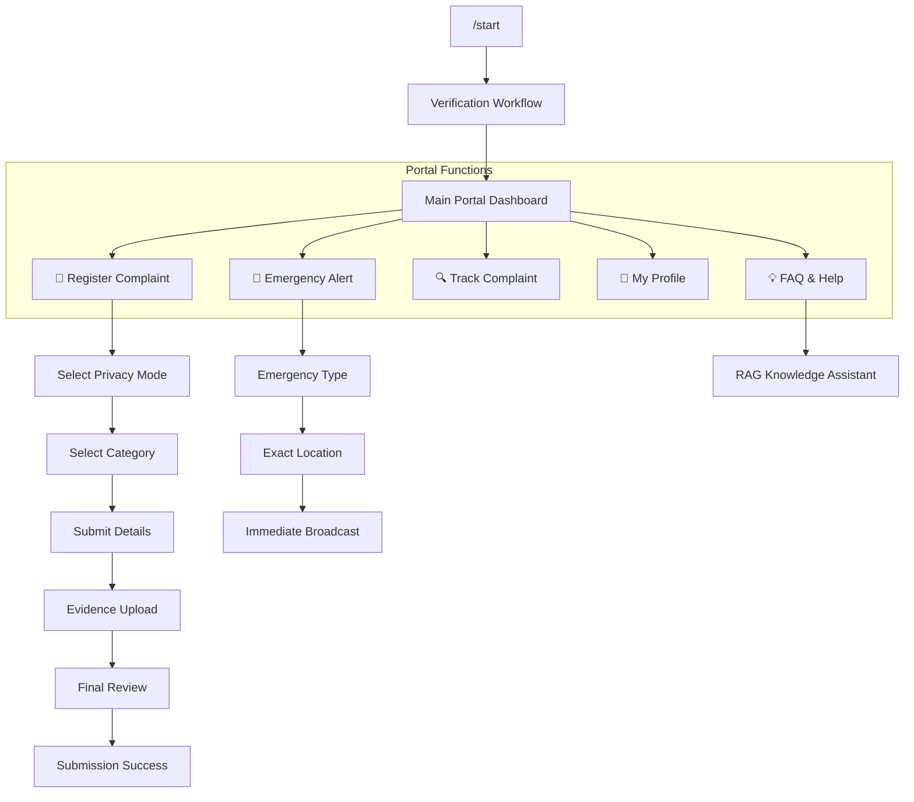

# 🛡️ MSAJCE Grievance Bot - Institutional Workflow Blueprint

## 🤖 Interaction Architecture
The bot operates as an **Official Administrative Gateway**. It uses a state-driven conversational UI with strict adherence to institutional etiquette and data protection standards.

---

## 🏛️ IDENTITY & REGISTRATION

### `/start` (The Greeting)
| Step | Bot Personality / Message | Options / Inputs |
| :--- | :--- | :--- |
| **Step 1** | "Welcome to the Official MSAJCE Grievance Assistance System..." | `[👨 Mr.]` `[👩 Ms.]` |
| **Step 2** | "Thank you. Please select your role in the institution." | `[🎓 Student]` `[👨‍🏫 Staff]` |
| **Step 3** | "Please enter your University Register Number / Staff ID." | *Manual ID Input* |
| **Step 4** | "Thank you Mr. [Name]. We have verified your identity..." | `[CSE]` `[IT]` `[ECE]` ... |
| **Step 5** | "Please confirm your phone number for official communication." | `[📱 Share Phone Number]` |

---

## 📝 COMPLAINT MANAGEMENT

### `📝 Register Complaint`
| Sequence | Interaction Message | User Options |
| :--- | :--- | :--- |
| **1. Privacy** | "Mr./Ms. [Name], how would you like to submit this?" | `[👤 Normal]` `[🎭 Anonymous]` |
| **2. Category** | "Please select the category that best describes your issue." | `[🏠 Hostel]` `[🚌 Transport]` `[🍱 Mess]` `[📚 Academics]` ... |
| **3. Details** | "Certainly Mr. [Name]. Please describe the issue in detail." | *Rich Text Input* |
| **4. Evidence** | "You may upload supporting evidence (photo/doc) now." | `[➡ Skip]` or *Upload* |
| **5. Review** | "Please review your complaint before submission." | `[✅ Submit]` `[❌ Cancel]` |

---

## 🚨 PRIORITY DISPATCH

### `🚨 Emergency Alert`
| Sequence | Interaction Message | User Options |
| :--- | :--- | :--- |
| **1. Type** | "⚠️ Alerts immediately notify security and administration." | `[🚑 Medical]` `[🔥 Fire]` `[🆘 Harassment]` `[🚨 Theft]` |
| **2. Location** | "Please provide the exact location of the incident." | *e.g., Hostel Block B* |
| **3. Finality** | "Confirm sending emergency alert?" | `[🚨 Send Now]` `[❌ Cancel]` |

---

## 💡 INTUITIVE ASSISTANCE

### `💡 FAQ & Help` (RAG Pipeline)
- **Engine**: Connected to the Unified **RAG Service** (Redis Cache -> Semantic FAQ -> Cross-Encoder Rerank).
- **Scope**: Handles natural language queries about bus routes, faculty names, college timings, and departments.
- **Workflow**: 
  1. User enters FAQ Mode.
  2. Submits question (e.g., *"Where is the Principal's office?"*).
  3. Bot retrieves verified data and generates a professional response using institutional context.

---

## 📩 ADMINISTRATIVE NOTIFICATIONS
Every valid submission triggers a **Senior-Grade Professional Email** to the HOD/Principal.
- **Header**: Institutional Branding with Emergency/Normal Status Tags.
- **Content**: Organized metadata (ID, Category, Description, Location).
- **Security**: Anonymous flags strip identity meta from the Department-level email.
- **Links**: Direct action links for HOD to `Review Ticket` or `Respond`.

---

## ⚙️ TECHNICAL STACK
- **Database**: MongoDB Atlas (Vector Similarity + Persistent Sessions).
- **Cache**: Upstash Redis (Latency optimization < 100ms).
- **Search**: Hybrid (Keyword Match + OpenAI Embedding Vector Search).
- **Reranker**: BGE-Reranker-Large (Ensuring 99%+ contextual accuracy).
- **Notification**: Nodemailer (Responsive Professional Templates).
